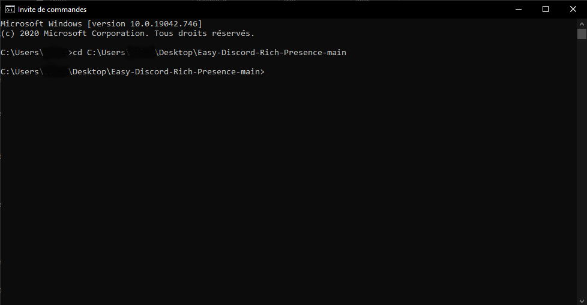

# Easy Discord Rich Presence
Rajoutez un plus à votre expérience sur Discord grâce à un statut personnalisé !  
Easy Discord Rich Presence est un petit script qui vous permet d'avoir un status personnalisé dit Rich Presence sur Discord et qui utilise le pacakage [discord-rpc](https://www.npmjs.com/package/discord-rpc).  
Avant de commencer, n'oubliez pas d'installer [node.js](https://nodejs.org/en/) et installez la version LTS.

## Setup
Premièrement, allez sur le site https://discord.com/developers/applications, connectez-vous et créez une application en cliquant sur "New Application" en haut à droite. Le nom de votre application sera le titre de votre status, le plus en haut et le plus visible, choisissez-le bien !  
Une fois sur votre application, allez dans l'onglet "Rich Presence" et descendez en bas de la page à "Rich Presence Assets". Cliquez sur "Add Image(s)" et mettez l'image que vous souhaitez (celle-ci sera affichée sur votre statut personnalisé en grand). Une fois téléchargée, mettez-lui un nom pas trop long et évitez les caractères spéciaux.  
Ensuite, installez le dossier en format .zip en cliquant sur le bouton vert "Code" en haut à droite ou en cliquant sur [ce lien](https://github.com/COCO150/Easy-Discord-Rich-Presence/archive/main.zip).  
Une fois téléchargé, affichez le dans le dossier, sélectionnez-le, faites clic droit dessus et cliquez sur "Extaire tout..." et mettez le dans le dossier que vous voulez.  
Ensuite, ouvrez le dossier une fois extrait, faites clic droit sur le fichier "config.json" et ouvrez le avec bloc-note ou votre IDE. Retournez sur votre application précedemment créée et rentrez le informations suivantes dans le fichier :  

```js
{
  "details": "", // ce texte d'affichera en 2ème ligne en dessous du nom de votre app.
  "state": "", // ce texte là sera juste en dessous de "details"
  "largeImageKey": "", // le nom que vous avez mis à votre image téléchargée sur votre application dans l'onglet Rich Presence Assets
  "largeImageText": "", // le texte que vous mettez ici sera affiché lorsque vous passerez la souris sur l'image du statut
  "clientId": "", // l'id de l'application créé. Il peut être retrouvé dans votre application, General Informations -> Client ID
  "buttons": { // OPTIONNEL : Des bouttons qui seront affichés en dessous de votre status. Attention : si vous décidez de mettre les boutons vous devez remplir les deux !
    "firstButton": {
      "name": "", // nom du premier bouton
      "url": "" // url vers lequel rediriger
    },
    "secondButton": {
      "name": "", // nom du deuxième bouton
      "url": "" // ...
    }
  }
}
```

N'oubliez pas de sauvegarder le fichier, et une fois que tout cela est fait, allez dans le dossier et copier le chemin de ce dernier en cliquant sur le nom du dossier en haut de l'explorateur de fichiers. Une fois copié, allez dans l'invite de commande et tapez `cd + le chemin copié`. Vous devriez avoir ca :  

</img>

Une fois dedans, tapez `npm i`, attendez un peu puis tapez `node .`.  
Si vous avez tout bien fait correctement, votre statut devrez s'afficher sur Discord.  
Si vous rencontrez des problèmes, n'hésitez pas à ouvrir une issue sur https://github.com/COCO150/Easy-Discord-Rich-Presence/issues en détaillant le plus possible, merci !
